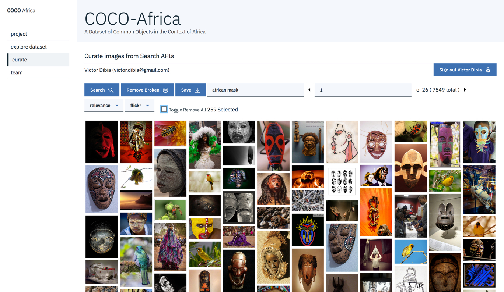
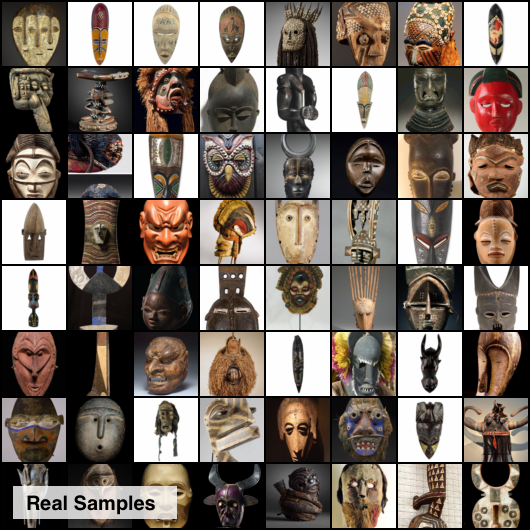
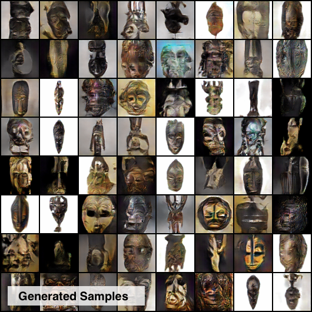
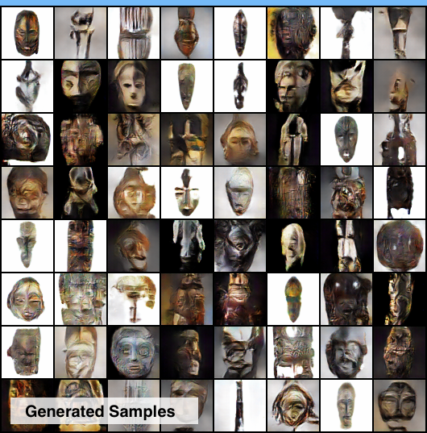

# COCO-Africa: A Curation Tool and Dataset of Common Objects in the Context of Africa
> Project is still in development **


The Coco Africa project is geared towards creating an easy to use data collection and curation tool to enable the curation of interesting (mostly underrepresented) datasets.

## The Data Collection Tool

This repo mainly contains code for the data collection interface(s) being used to support the curation of the COCO-Africa dataset. The current web interface is built with the following main features.
- Perform image searches under a given keyword, selectively save a subset of all results. Searching using the flickr interface is currently supported.
- Support annotation of saved images.

## The Datasets

- COCO Africa Masks (To be released soon): A dataset of African masks to foster experiments in the intersection of African Art and AI.
Early results training an unconditional GAN (DCGAN) on a curated dataset of African masks (10k) are shown below.



## Trained Models
As the project progresses, trained models will be made available for tasks trained on aspects of the COCO-Africa dataset.

## Setup

Add your flickr and google client app credentials in the `utils/credentials_default.py` file and then rename it to `credentials.py`

```shell
cd utils
cp credentials_default.py credentials.py   #rename file
```

## Running

```
python webserver.py
```


## Citing this tutorial

If you'd like to cite this work, use the below.

Victor Dibia, COCO-AFRICA : A Curation Tool and Dataset of Common Objects in the Context of Africa (2018), GitHub repository, https://github.com/victordibia/coco-africa
```bib
@misc{CocoAfricaDibia2018,
  author = {Victor, Dibia},
  title = {COCO-AFRICA : A Curation Tool and Dataset of Common Objects in the Context of Africa},
  year = {2018},
  publisher = {GitHub},
  journal = {GitHub repository},
  howpublished = {\url{https://github.com/victordibia/coco-africa}} 
}